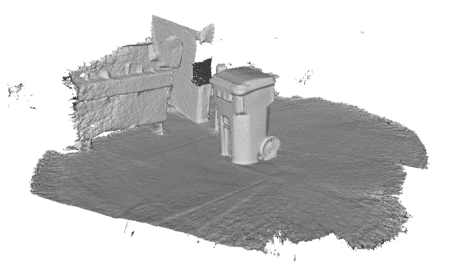
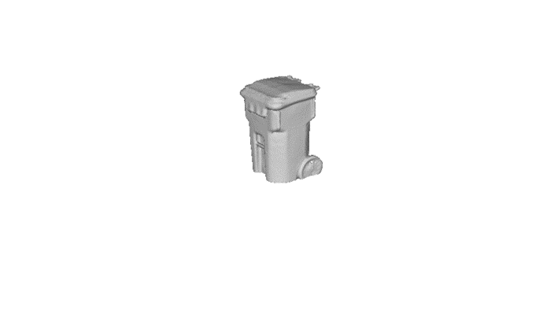

# 3d-scan-cleaner
Script to orient, clean, normalize, and fill holes in 3D scans.

Before             |  After
:-------------------------:|:-------------------------:
  |  

## Installation 

To use, clone the repo and then install the requirements via pip:

```bash
virtualenv -p python3 env
source env/bin/activate
pip install -r requirements.txt
```

Tested with ubuntu18.04 and python3.6. 

## Usage

To test your installation run:

```bash
python clean.py examples/00007.ply out.ply --verbose
```

The following arguments can be passed to the script:

